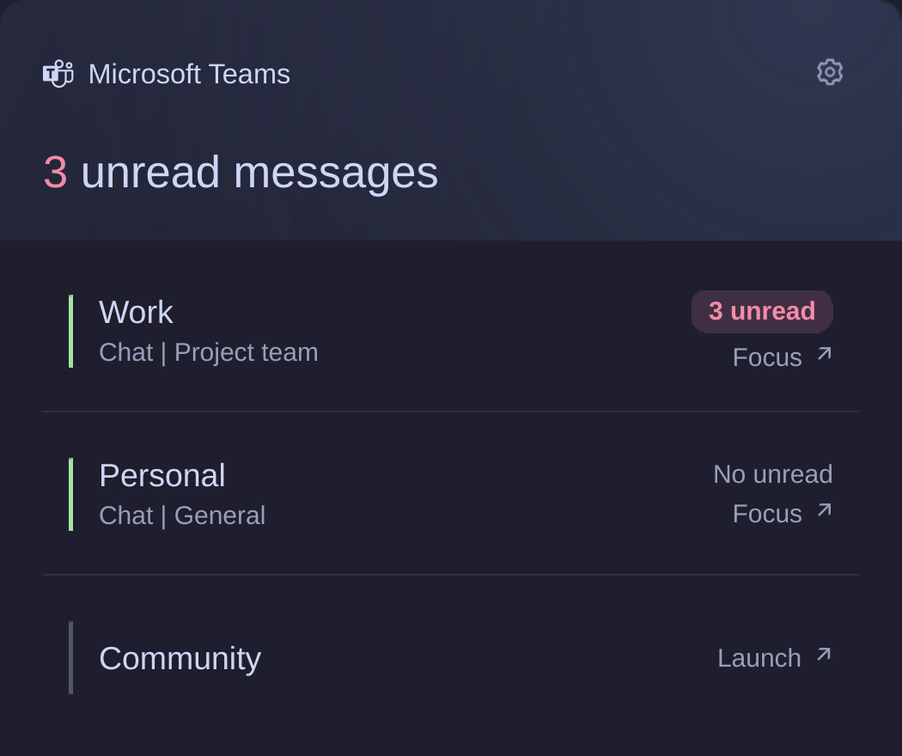

# Foamy Teams

Microsoft Teams account switching and unread status.



## Install

Requires Omarchy Quattro with Quickshell's Wayland toplevel support, Python 3,
and a browser or client that opens Teams in separate account windows.
No additional Python packages or Microsoft API credentials are required.

```sh
omarchy plugin add https://github.com/foamrider/foamy-teams.git --enable
```

Remove the previous Teams widget from the bar when replacing it.

## Use

1. Open Teams in a separate browser profile for each account.
2. Left-click the widget, open the cog, and choose **Add account**.
3. Select the open Teams window, give the account a name, and set its browser profile.
4. Select an account in the panel to focus its window or launch it.

Unread counts appear in red badges. Green markers identify running accounts;
closed accounts show **Launch**. Right-click the widget to open settings.
Middle-click opens your selected default account, or the account with the most
unread messages, preferring focused and running accounts when counts are equal.

In the panel, use arrows or J/K to select accounts, Enter to open them, S for
settings, and Escape to go back or close.

### Settings

Rename, reorder, disable, or remove accounts in the cog menu. Configure the bar
count, visibility when all accounts are closed, window context, closed-account
rows, unread-first sorting, default account, and English or Norwegian language.
Settings are saved on the `foamy.teams` widget entry in Omarchy's `shell.json`.
No accounts or machine-specific profiles are included in the plugin defaults.

The window picker copies the application's ID. It cannot discover Microsoft
account identities or infer which browser profile launches a window. Each
account needs a distinct application ID; you can also enter it manually.
Removing an account removes only its plugin configuration, not its browser profile.

The default launcher is `omarchy-launch-webapp`. Other browser executables must
support Chromium's `--app=URL` and `--profile-directory` arguments. A blank
profile uses the browser's default. For another client, enter **Advanced launch
arguments** as a JSON array, such as `["example-client", "--profile", "work"]`.
This overrides the browser, profile, and URL fields. Arguments are passed
directly, without a shell. The plugin does not create profiles or sign in.

### Unread counts

Counts come from a leading `(N)` in matched window titles. A recognized Microsoft
Teams title without this prefix is treated as zero. Closed windows, sign-in
pages, and unrecognized titles have an unknown count. This uses window titles,
not the Microsoft message API; title changes can make counts unavailable or
incomplete. The displayed window context is not a preview of the unread message.

Multiple windows for an account use the highest reported count to avoid double
counting. Opening the panel does not mark messages read. Window changes update
reactively, without polling or background Teams requests.

## Development

With Node.js and Python 3 installed, run:

```sh
node tests/model.test.js
python3 -m unittest discover -s tests -p 'test_*.py'
omarchy plugin validate "$PWD"
```

The screenshot uses demo accounts rendered by the plugin.

## Remove

```sh
omarchy plugin remove foamy.teams
```

Browser profiles, Teams accounts, open windows, and sign-in sessions remain
unchanged. Removing the widget does not sign out or delete browser data.

Omarchy manages the plugin entry in `shell.json`. Packages and data outside
the plugin directory are retained unless you remove them separately.

## License

Licensed under [MIT](LICENSE), with [Omarchy](LICENSE-OMARCHY) and
[Lucide](LICENSE-LUCIDE) notices.

Provided **as is**, without warranty or guaranteed support. Use at your own risk.
